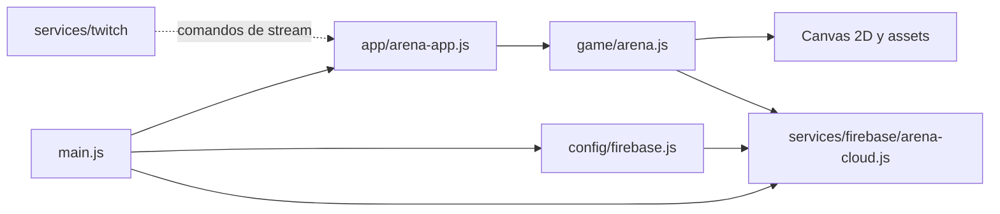

# Ki Arena

Juego de arena 2D en HTML, CSS y JavaScript. Firestore guarda los perfiles, el progreso, el chat y las bajas; el navegador ejecuta la simulación y presenta el canvas.

## Estructura

```text
KiArena/
├── firebase.json                 # Firebase Hosting sirve public/
├── .firebaserc                   # Proyecto de Firebase CLI
├── FIREBASE.md                   # Datos, entornos y seguridad
└── public/
    ├── index.html                # Página de entrada
    ├── ki-arena.html             # URL anterior redirigida a index.html
    ├── assets/                   # Fondo, sprites y efectos
    ├── styles/arena.css          # Estilos de interfaz
    └── src/
        ├── main.js               # Compone servicios y arranca la arena
        ├── app/arena-app.js      # Entrada de la aplicación
        ├── game/arena.js         # Canvas, animación, combate e interacción
        ├── config/firebase.js    # Selección dev/qa/prod y configuración web
        └── services/
            ├── firebase/arena-cloud.js # Persistencia Firestore
            └── twitch/                 # Punto previsto para conectar el chat
```



La lógica de arena se conserva junta en `game/arena.js` durante esta primera reorganización para reducir el riesgo de alterar el combate. La interfaz, el motor, el chat y el input se pueden extraer a módulos más pequeños después, conservando la misma API de persistencia.

## Entornos

El selector usa `?env=dev`, `?env=qa` o `?env=prod` para elegir las colecciones. Hoy esos espacios comparten el proyecto `sayayin-c0dfe`; son separación lógica, no aislamiento de permisos, cuotas o facturación. Producción real debe usar su propio proyecto Firebase y reglas.

La página anterior `/ki-arena.html` permanece disponible como redirección a `/index.html`, conservando el parámetro del entorno. La simulación vive en memoria; Firestore mantiene los datos persistentes.

## Desarrollo local

Desde `KiArena/`, ejecuta `firebase.cmd emulators:start --only hosting --project sayayin-c0dfe` y abre `http://127.0.0.1:5000/`.

