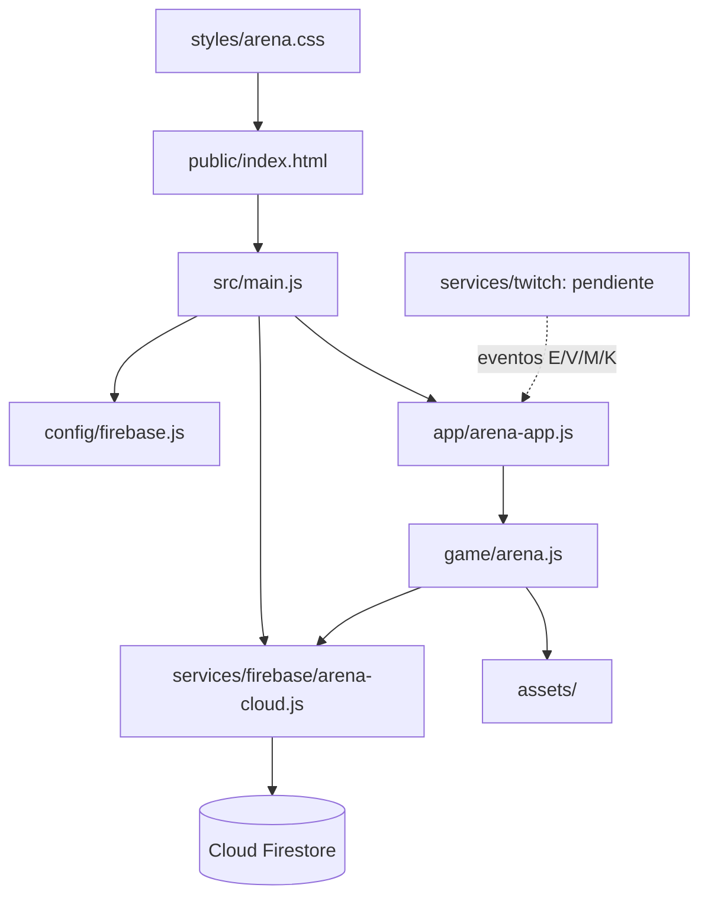

# Arquitectura de Ki Arena

## Estado ejecutable

Firebase Hosting sirve `KiArena/public/`. No hay proceso Node en producción ni paso de compilación. `public/index.html` carga CSS y un módulo ES que compone la configuración, el repositorio Firebase y la aplicación. La URL histórica `public/ki-arena.html` conserva el query string y redirige a `index.html`.

```text
Repositorio/
├── AGENTS.md                         # Contexto de trabajo del repositorio
├── .agents/skills/ki-arena-project/  # Skill de mantenimiento
├── KiArena/
│   ├── .firebaserc                   # Alias del proyecto Firebase CLI
│   ├── firebase.json                 # Hosting: public/
│   ├── README.md / FIREBASE.md
│   ├── docs/                         # Especificaciones y registro
│   └── public/
│       ├── index.html                # Punto de entrada actual
│       ├── ki-arena.html             # Redirección compatible
│       ├── assets/                   # Fondo y hojas de sprites
│       ├── styles/arena.css
│       └── src/
│           ├── main.js               # Configuración y composición
│           ├── app/arena-app.js      # Arranque de la arena
│           ├── config/firebase.js    # Entorno y configuración web
│           ├── game/arena.js         # Simulación, canvas, chat y UI actual
│           └── services/
│               ├── firebase/arena-cloud.js
│               └── twitch/README.md # Contrato previsto; sin cliente activo
└── KiArena/docs/
```

## Responsabilidades y límites

| Módulo | Responsabilidad | No debe asumir |
|---|---|---|
| `main.js` | Crear la configuración de Firebase, instalar el servicio compatible con el juego y arrancar la app. | Reglas de combate o renderizado. |
| `app/arena-app.js` | Punto de arranque y ciclo de vida de la vista de arena. | Formato REST de Firestore o OAuth. |
| `game/arena.js` | Bucle de animación, movimiento, rebotes, duelos, técnicas, canvas y eventos de UI/chat. | Construir URLs Firestore ni contener secretos Twitch. |
| `config/firebase.js` | Validar `env` de URL y componer el espacio lógico del proyecto. | Autenticación o aislamiento real entre proyectos. |
| `services/firebase/arena-cloud.js` | Adaptar lecturas y escrituras Firestore a métodos de dominio (`get`, `save`, `addMessage`, `addEvent`, listas y estado). | Reglas de combate ni autoridad de XP/KO. |
| `services/twitch/` | Futuro adaptador: traducir mensaje entrante a nombre y comando de arena. | Persistir directamente el perfil o ejecutar combate. |

Dependencias actuales:



## Límites conocidos / siguiente refactor

`game/arena.js` conserva hoy el bucle, reglas de combate, dibujo, paneles y manejo del chat para disminuir el riesgo de regresión durante el primer cambio de carpetas. La separación de carpetas y del adaptador de datos ya existe; el módulo de arena no está aún dividido internamente en `engine`, `renderer`, `combat`, `chat` y `roster`. Hacerlo en pasos pequeños, preservar una interfaz de estado explícita y volver a verificar el canvas después de cada extracción.

La capa Firebase usa el API REST de Firestore desde el navegador y expone una interfaz global compatible con el motor actual. No hay Firebase Admin SDK, Cloud Functions ni servidor de juego. El API key web identifica el proyecto y no sustituye reglas de acceso.

## Ejecutar y verificar

Desde `KiArena/`:

```powershell
firebase.cmd emulators:start --only hosting --project sayayin-c0dfe
```

Abre `http://127.0.0.1:5000/` o la ruta compatible `/ki-arena.html?env=dev`. Hosting debe servir el contenido de `public/`; la configuración de entorno determina las colecciones consultadas.

